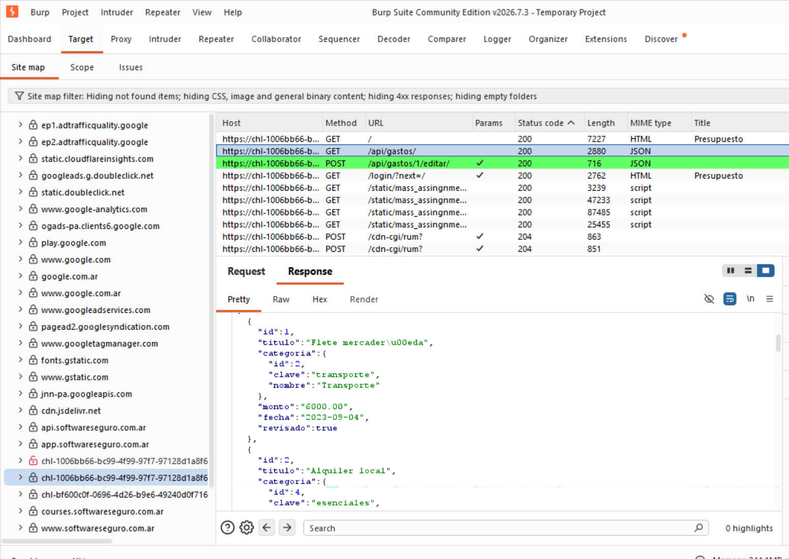

# Objetivo 4 – Intercepción de tráfico: Proxy y VPN

## Intercepción del tráfico

Para realizar la práctica utilicé **Burp Suite Community Edition** como proxy
para observar el tráfico generado entre el navegador y la aplicación web del
laboratorio.

A continuación se muestra la evidencia obtenida:

En la captura se puede observar que Burp Suite logró capturar las peticiones
realizadas por la aplicación.

Por ejemplo, se pueden identificar las siguientes peticiones:

- `GET /api/gastos/`
- `POST /api/gastos/1/editar/`

La petición `GET /api/gastos/` permite obtener información de los gastos
registrados en la aplicación.

En la parte inferior de Burp Suite también se puede observar la respuesta del
servidor en formato **JSON**, donde aparecen datos como:

- `id`
- `titulo`
- `categoria`
- `monto`
- `fecha`
- `revisado`

También se observa una petición:

`POST /api/gastos/1/editar/`

Esta petición corresponde a una operación realizada sobre un gasto de la
aplicación.

La captura demuestra que Burp Suite está funcionando como intermediario entre
el navegador y el servidor y permite analizar las peticiones y respuestas
intercambiadas.

---

## ¿Qué es un Proxy?

Un **proxy** es un intermediario entre nuestro navegador y el servidor al que
queremos acceder.

Normalmente la comunicación sería:

Navegador → Servidor

Cuando utilizamos un proxy:

Navegador → Proxy → Servidor

El navegador envía primero la petición al proxy y este luego la envía al
servidor.

En este ejercicio, **Burp Suite funciona como proxy**, permitiendo observar
el tráfico que genera la aplicación.

Además de visualizar las peticiones, un proxy de este tipo puede permitir
interceptarlas y modificarlas antes de enviarlas al servidor.

Esto resulta muy útil para realizar pruebas de seguridad y entender cómo se
comunica una aplicación web con su Backend.

---

## ¿Qué es una VPN?

Una **VPN (Virtual Private Network)** crea una especie de túnel seguro entre
nuestro dispositivo y un servidor VPN.

De forma simplificada:

Dispositivo → Túnel VPN → Servidor VPN → Internet

El tráfico del dispositivo pasa por ese túnel antes de salir a Internet.

Las VPN se utilizan, por ejemplo, para conectarse de forma segura a una red
privada de una empresa o para proteger el tráfico cuando utilizamos una red
que no es de confianza.

---

## Diferencia entre Proxy y VPN

Aunque ambos pueden actuar como intermediarios, tienen funciones diferentes.

| Proxy | VPN |
|---|---|
| Actúa como intermediario entre una aplicación y un servidor. | Crea un túnel entre el dispositivo y un servidor o red VPN. |
| Puede configurarse para interceptar tráfico web. | Generalmente protege y redirige el tráfico del dispositivo. |
| Permite observar peticiones y respuestas HTTP/HTTPS. | Su objetivo principal no es analizar peticiones HTTP. |
| Un proxy como Burp Suite permite modificar peticiones durante pruebas. | Una VPN normalmente no se utiliza para modificar peticiones web. |
| Es muy utilizado para pruebas de seguridad web. | Es utilizada principalmente para conexiones seguras y acceso a redes privadas. |

---

## Conclusión

En esta práctica utilicé **Burp Suite como proxy** para observar la comunicación
entre el navegador y el servidor.

Gracias a la intercepción fue posible identificar las peticiones que realiza
la aplicación, como `GET /api/gastos/` y `POST /api/gastos/1/editar/`, además
de visualizar las respuestas JSON enviadas por el servidor.

Esto demuestra que un proxy es una herramienta muy útil para analizar cómo
funciona una aplicación web y estudiar las peticiones y respuestas que se
intercambian entre el Frontend y el Backend.

La principal diferencia con una VPN es que el proxy puede utilizarse para
inspeccionar y manipular tráfico específico, mientras que una VPN está
orientada principalmente a crear un túnel seguro y redirigir el tráfico de red.