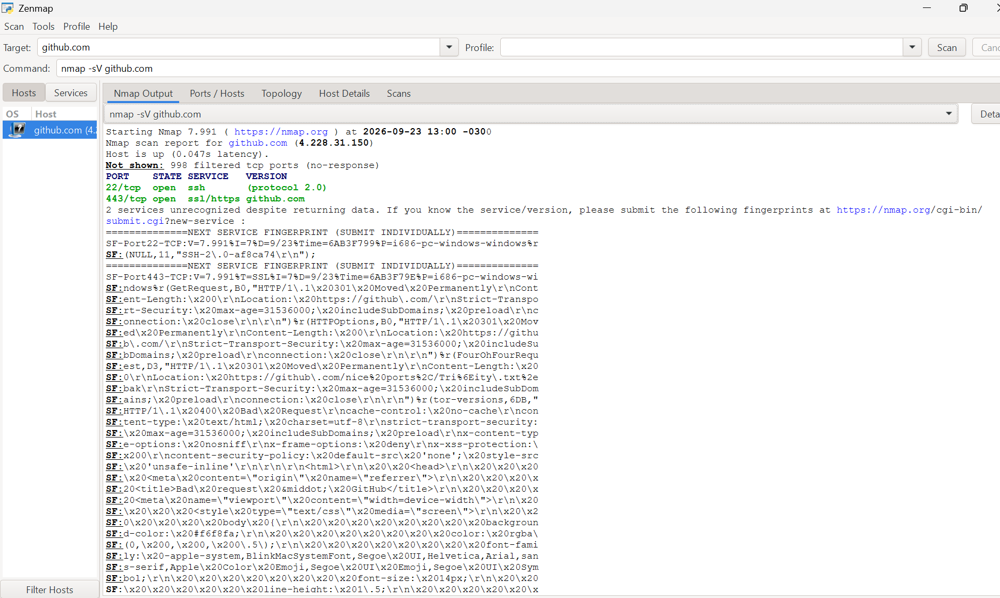
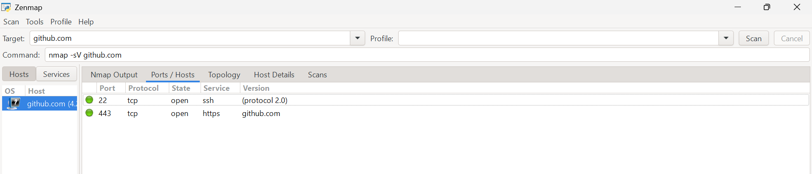
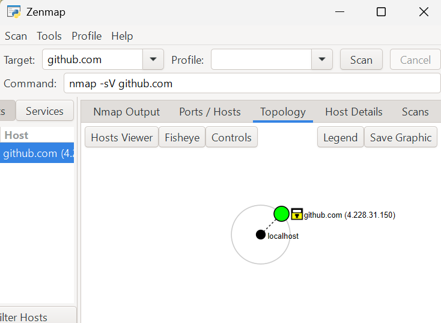

# Objetivo 2: Escaneo de Red (Nmap)

## Introducción

En este ejercicio se utilizó **Nmap (Network Mapper)** para realizar un escaneo básico sobre un objetivo autorizado.

Nmap es una herramienta utilizada para el reconocimiento de redes y servidores. Permite obtener información como los **puertos abiertos**, los **servicios que se encuentran disponibles** y, en algunos casos, información adicional sobre los protocolos o versiones utilizadas.

Antes de realizar cualquier escaneo es importante verificar que exista autorización para hacerlo. Por este motivo, para esta práctica se seleccionó un objetivo perteneciente a un programa de **Bug Bounty**, revisando previamente tanto las reglas como el alcance (*scope*) del programa.

---

## Selección del programa de Bug Bounty

Para realizar la práctica se seleccionó el programa:

**GitHub Bug Bounty**

Página oficial:

https://bounty.github.com/

Antes de realizar el escaneo se revisaron dos secciones importantes del programa:

- Las reglas del programa.
- Los objetivos incluidos dentro del *scope*.

Reglas oficiales:

https://bounty.github.com/rules

Scope oficial:

https://bounty.github.com/scope

---

## Verificación de autorización

Se seleccionó el programa de GitHub porque sus reglas permiten el uso de **herramientas automatizadas** siempre que se utilicen de manera controlada y no generen tráfico excesivo.

Dentro de las reglas del programa se contempla como ejemplo permitido la ejecución de un **escaneo Nmap sobre un único host**.

Para respetar estas condiciones, en esta práctica se realizó únicamente un escaneo básico sobre un solo objetivo.

No se realizaron:

- Escaneos masivos.
- Escaneos sobre múltiples hosts.
- Ataques de denegación de servicio.
- Pruebas destinadas a degradar el funcionamiento del servicio.
- Explotación de vulnerabilidades.

El objetivo de la práctica fue únicamente identificar los **puertos abiertos y servicios disponibles**.

---

## Verificación del Scope

Además de revisar las reglas, se verificó que el dominio seleccionado estuviera incluido dentro del alcance del programa.

El dominio principal:

```text
github.com
```

se encuentra incluido dentro del *scope* del programa GitHub Bug Bounty.

Por lo tanto, el objetivo utilizado para esta práctica fue:

**Host:** `github.com`


---

## Herramienta utilizada

Para realizar el escaneo se utilizó:

**Nmap (Network Mapper)**

En este caso se utilizó mediante **Zenmap**, que proporciona una interfaz gráfica para ejecutar y visualizar los resultados de Nmap.

Nmap permite realizar diferentes tipos de reconocimiento sobre un host, entre ellos:

- Identificar hosts activos.
- Detectar puertos abiertos.
- Identificar servicios asociados a los puertos.
- Obtener información sobre protocolos.
- Intentar identificar versiones de determinados servicios.

Para este ejercicio se utilizó únicamente la funcionalidad necesaria para detectar **puertos y servicios**.

---

## Configuración del escaneo

En Zenmap se configuró como objetivo:

```text
github.com
```

Luego se utilizó el siguiente comando:

```bash
nmap -sV github.com
```

### Explicación del comando

El comando utilizado está compuesto por:

- `nmap`: ejecuta la herramienta Nmap.
- `-sV`: activa la detección de servicios y versiones.
- `github.com`: corresponde al host autorizado seleccionado como objetivo.

La opción `-sV` permite que Nmap no solamente determine qué puertos están abiertos, sino que también intente identificar qué **servicio está funcionando detrás de cada puerto**.

---

## Ejecución del escaneo

Una vez configurado el objetivo y el comando, se inició el escaneo desde Zenmap.

Durante la ejecución realizada, Nmap resolvió el dominio:

```text
github.com
```

a la dirección IP:

```text
4.228.31.150
```

Esta dirección IP corresponde al resultado obtenido durante la ejecución de esta práctica y puede cambiar en otro momento debido a la infraestructura utilizada por el servicio.

Nmap informó además que el host se encontraba activo:

```text
Host is up
```

---

## Resultados obtenidos

El escaneo encontró **2 puertos TCP abiertos**.

Los resultados principales fueron:

| Puerto | Protocolo | Estado | Servicio | Información detectada |
|---|---|---|---|---|
| 22 | TCP | Open | SSH | Protocol 2.0 |
| 443 | TCP | Open | HTTPS | github.com |

También se obtuvo el siguiente resultado:

```text
Not shown: 998 filtered tcp ports (no-response)
```

Esto significa que, de los puertos TCP analizados por defecto por Nmap, **998 fueron clasificados como filtrados**, ya que Nmap no recibió una respuesta que permitiera determinar que estuvieran abiertos.

---

## Puerto 22/TCP - SSH

El primer puerto abierto encontrado fue:

```text
22/tcp open ssh
```

El puerto **22/TCP** está asociado normalmente al protocolo **SSH (Secure Shell)**.

SSH permite establecer comunicaciones remotas mediante conexiones cifradas.

Nmap también identificó:

```text
protocol 2.0
```

indicando el uso de la versión 2 del protocolo SSH.

En GitHub, SSH puede utilizarse también para interactuar de forma segura con repositorios Git.

Por ejemplo, es posible configurar una clave SSH y utilizar una dirección de repositorio como:

```text
git@github.com:usuario/repositorio.git
```

para realizar operaciones como `clone`, `pull` o `push` sin utilizar usuario y contraseña en cada operación.

---

## Puerto 443/TCP - HTTPS

El segundo puerto abierto identificado fue:

```text
443/tcp open ssl/https
```

El puerto **443/TCP** es utilizado normalmente por **HTTPS**.

HTTPS permite realizar comunicaciones web protegidas mediante TLS.

Gracias a este mecanismo, la información transmitida entre el navegador del usuario y el servidor puede viajar cifrada.

En este caso, Nmap identificó el servicio asociado a:

```text
github.com
```

Por lo tanto, este puerto corresponde al servicio web seguro utilizado para acceder a GitHub mediante:

```text
https://github.com
```

---

## Puertos filtrados

Además de los dos puertos abiertos, Nmap mostró:

```text
Not shown: 998 filtered tcp ports (no-response)
```

Un puerto marcado como **filtered** significa que Nmap no pudo determinar directamente si el puerto estaba abierto o cerrado debido a que no recibió una respuesta adecuada.

Esto puede ocurrir por diferentes mecanismos de seguridad o filtrado de red.

Por lo tanto, un puerto filtrado **no debe interpretarse automáticamente como un puerto cerrado**.

---

## Captura de la ejecución

La siguiente captura muestra la ejecución del comando:

```bash
nmap -sV github.com
```

junto con los resultados obtenidos desde la pestaña **Nmap Output** de Zenmap.



En la salida puede observarse:

- El objetivo utilizado.
- La dirección IP resuelta durante la ejecución.
- Los puertos abiertos encontrados.
- Los servicios identificados.
- Los puertos filtrados.

---

## Visualización de puertos y servicios

Zenmap también permite visualizar de forma resumida los puertos encontrados y los servicios asociados.



En esta visualización se pueden identificar claramente los dos puertos abiertos:

```text
22/tcp  open  ssh
443/tcp open  https
```

---

## Topología

Zenmap también proporciona una representación gráfica básica de la relación entre el equipo desde donde se realiza el análisis y el host analizado.



En esta representación se puede observar el host local y el objetivo `github.com` detectado durante el escaneo.

---

## Análisis de los resultados

A partir del escaneo realizado se pudieron identificar dos servicios accesibles desde el host analizado:

1. **SSH mediante el puerto 22/TCP.**
2. **HTTPS mediante el puerto 443/TCP.**

La presencia de un puerto abierto **no significa que exista una vulnerabilidad**.

Un puerto abierto simplemente indica que existe un servicio escuchando y aceptando determinado tipo de comunicación.

Durante una evaluación de seguridad, esta información puede utilizarse como parte de la etapa inicial de reconocimiento para comprender qué servicios expone un determinado servidor.

Cualquier análisis adicional debería realizarse siempre respetando las reglas y el alcance establecido por el propietario del sistema.

---

## Resultado final

El resultado principal de la práctica fue:

```text
Objetivo: github.com

Puertos abiertos encontrados:

22/TCP  → SSH
443/TCP → HTTPS

Puertos TCP filtrados informados por Nmap: 998
```

De esta forma se logró cumplir con el objetivo del ejercicio de identificar **puertos abiertos y servicios detectados utilizando Nmap sobre un objetivo autorizado**.

---

## Conclusión

Esta práctica permitió comprender el funcionamiento básico de **Nmap** como herramienta de reconocimiento de red.

Mediante el comando:

```bash
nmap -sV github.com
```

se realizó un escaneo limitado sobre un único host autorizado dentro del programa GitHub Bug Bounty.

Como resultado se identificaron los puertos **22/TCP (SSH)** y **443/TCP (HTTPS)** como abiertos, mientras que Nmap informó otros **998 puertos TCP como filtrados**.

Además de aprender a interpretar los resultados de Nmap, esta actividad permitió comprender un aspecto fundamental de las pruebas de seguridad: **antes de analizar infraestructura que no nos pertenece es necesario verificar que exista autorización y respetar estrictamente el scope y las reglas establecidas**.

De esta manera, las herramientas de reconocimiento pueden utilizarse de forma responsable dentro de entornos y programas específicamente autorizados.