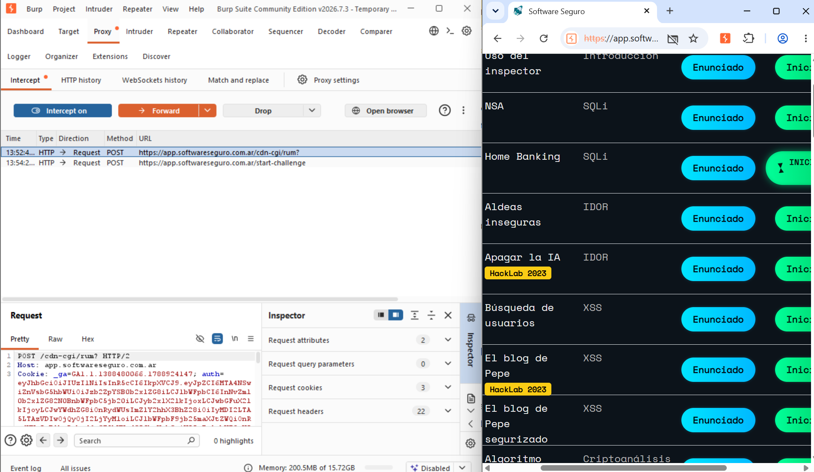
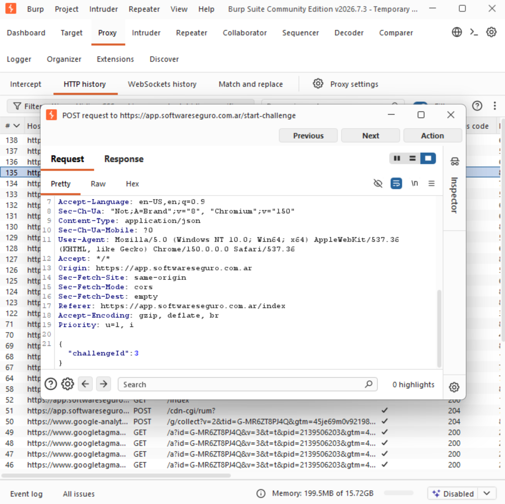
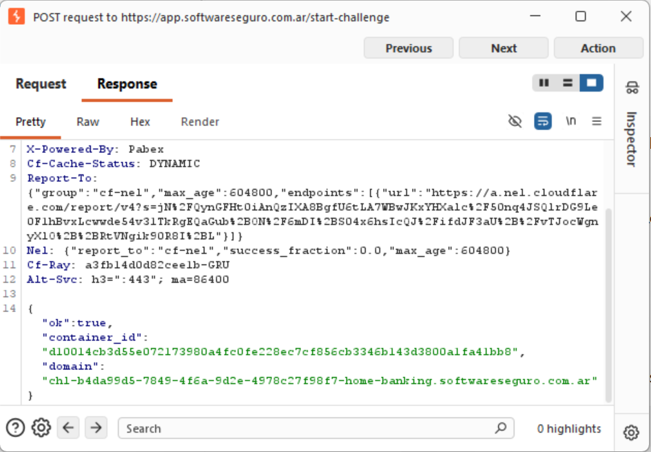
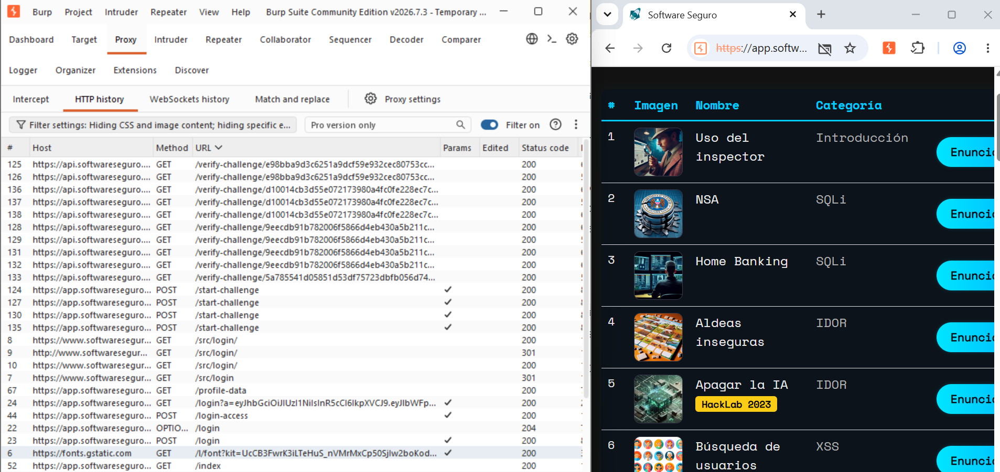

# Objetivo 1: Man-in-the-Middle Local - Configuración y Certificado CA

## Introducción

En esta actividad se utilizó **Burp Suite Community Edition** para analizar el tráfico HTTP/HTTPS generado entre el navegador y los laboratorios de Software Seguro.

Burp Suite permite funcionar como un **proxy de interceptación**, ubicándose entre el navegador y el servidor de destino.

De esta manera, las peticiones realizadas por el navegador pasan primero por Burp Suite antes de llegar al servidor.

El flujo puede representarse de la siguiente manera:

```text
Navegador
    │
    │ Petición HTTP/HTTPS
    ▼
┌─────────────────────┐
│     Burp Suite      │
│   Proxy local       │
│  127.0.0.1:8080     │
└─────────────────────┘
    │
    │ Petición
    ▼
Servidor de Software Seguro
```

Esto permite visualizar, detener e inspeccionar las peticiones antes de que lleguen al servidor.

---

## Herramienta utilizada

Para realizar la práctica se utilizó:

**Burp Suite Community Edition**

Burp Suite es una herramienta utilizada para analizar aplicaciones web y permite, entre otras funcionalidades:

- Interceptar peticiones HTTP y HTTPS.
- Visualizar los headers de las peticiones.
- Analizar parámetros enviados por el navegador.
- Visualizar cookies.
- Inspeccionar el body de las peticiones.
- Analizar las respuestas enviadas por el servidor.
- Consultar el historial de tráfico HTTP.

Para esta actividad se utilizó principalmente el módulo:

```text
Proxy
```

y las funcionalidades:

```text
Intercept
HTTP history
```

---

## Configuración del proxy

Burp Suite utiliza por defecto un proxy local que escucha en:

```text
127.0.0.1:8080
```

La dirección:

```text
127.0.0.1
```

corresponde a la interfaz local o **loopback** del equipo.

El puerto:

```text
8080
```

es utilizado por Burp para recibir las peticiones provenientes del navegador.

Para simplificar la configuración se utilizó el navegador integrado de Burp Suite mediante la opción:

```text
Open browser
```

Este navegador ya se encuentra configurado para enviar su tráfico a través del proxy de Burp.

---

## Certificado CA y tráfico HTTPS

Como los laboratorios de Software Seguro utilizan **HTTPS**, Burp necesita poder inspeccionar conexiones protegidas mediante TLS.

Para esto Burp utiliza su propio **certificado CA (Certificate Authority)**.

Al confiar en el certificado CA de Burp dentro del navegador utilizado para las pruebas, la herramienta puede inspeccionar el tráfico HTTPS generado durante el laboratorio.

Esto permite visualizar las peticiones y respuestas HTTPS dentro del proxy.

En esta práctica se utilizó el navegador integrado de Burp Suite, preparado para trabajar con el proxy y su certificado CA.

---

## Objetivo analizado

Para realizar la práctica se utilizó la plataforma autorizada de laboratorios de:

**Software Seguro**

Durante la navegación se analizaron solicitudes correspondientes a:

```text
https://app.softwareseguro.com.ar
```

El análisis se realizó exclusivamente sobre el entorno proporcionado para las actividades del curso.

---

## Interceptación de una petición

Dentro de Burp Suite se accedió a:

```text
Proxy → Intercept
```

y se activó:

```text
Intercept is on
```

Luego, desde la aplicación de Software Seguro, se seleccionó uno de los laboratorios disponibles.

En este caso se utilizó el laboratorio:

```text
Home Banking
```

Al intentar iniciar el laboratorio, Burp Suite detuvo la petición antes de que continuara hacia el servidor.

La petición interceptada fue:

```http
POST /start-challenge
Host: app.softwareseguro.com.ar
Content-Type: application/json
```

De esta forma se pudo observar la solicitud mientras se encontraba detenida dentro del proxy.

### Captura de la petición interceptada



En la captura puede observarse que la opción:

```text
Intercept on
```

se encuentra activa y la petición está detenida antes de continuar hacia el servidor.

Burp permite en ese momento elegir entre acciones como:

```text
Forward
```

para permitir que la petición continúe, o:

```text
Drop
```

para descartarla.

---

## Análisis del Request

Al inspeccionar la petición `POST /start-challenge`, se encontró que el navegador enviaba información utilizando formato JSON.

El body observado fue:

```json
{
  "challengeId": 3
}
```

El campo:

```text
challengeId
```

indica qué challenge o laboratorio desea iniciar el usuario.

En esta ejecución se envió:

```text
challengeId = 3
```

correspondiente al laboratorio seleccionado durante la práctica.

### Captura del Request



Esta captura permite observar el método utilizado, los headers HTTP y el contenido JSON enviado hacia el servidor.

---

## Análisis del Response

Luego de inspeccionar la petición se utilizó la opción:

```text
Forward
```

para permitir que continuara hacia el servidor.

El servidor respondió correctamente e informó que la instancia del challenge había sido iniciada.

La estructura observada en la respuesta fue similar a:

```json
{
  "ok": true,
  "container_id": "<identificador_del_contenedor>",
  "domain": "<dominio_del_laboratorio>"
}
```

El campo:

```text
"ok": true
```

indica que la operación se realizó correctamente.

El campo:

```text
container_id
```

contiene un identificador correspondiente a la instancia generada para el laboratorio.

Finalmente:

```text
domain
```

contiene el dominio asignado a la instancia del laboratorio.

En este caso, el dominio generado correspondía al laboratorio:

```text
home-banking.softwareseguro.com.ar
```

### Captura de la respuesta



---

# Endpoints encontrados

Mediante la sección:

```text
Proxy → HTTP history
```

se pudieron observar diferentes endpoints utilizados por la plataforma de Software Seguro.

Para el análisis se ignoraron solicitudes pertenecientes a servicios externos como Google Analytics, Google Tag Manager, Cloudflare y otros recursos que no correspondían directamente al funcionamiento de los laboratorios.

Los principales endpoints identificados fueron los siguientes.

---

## GET /challenges

**Método:**

```http
GET
```

**Endpoint:**

```text
/challenges
```

### Función

Este endpoint es utilizado por la aplicación para obtener información sobre los **challenges o laboratorios disponibles**.

La información obtenida permite construir el listado que posteriormente visualiza el usuario en la interfaz de Software Seguro.

---

## POST /start-challenge

**Método:**

```http
POST
```

**Endpoint:**

```text
/start-challenge
```

### Función

Este endpoint permite solicitar el inicio de un laboratorio determinado.

La aplicación envía un JSON indicando el identificador del challenge que se desea iniciar.

Durante la práctica se observó:

```json
{
  "challengeId": 3
}
```

El servidor procesa la solicitud e inicia una instancia del laboratorio correspondiente.

Como respuesta devuelve información relacionada con la instancia creada, incluyendo:

```text
ok
container_id
domain
```

Por lo tanto, el flujo observado fue:

```text
Usuario selecciona un laboratorio
            ↓
POST /start-challenge
            ↓
{
  "challengeId": 3
}
            ↓
Servidor inicia la instancia
            ↓
{
  "ok": true,
  "container_id": "...",
  "domain": "...home-banking.softwareseguro.com.ar"
}
```

---

## GET /verify-challenge/{id}

**Método:**

```http
GET
```

**Endpoint observado:**

```text
/verify-challenge/{id}
```

### Función

Luego de iniciar un challenge, se observaron solicitudes hacia este endpoint utilizando un identificador asociado a la instancia.

Por ejemplo:

```text
GET /verify-challenge/<identificador>
```

A partir del comportamiento observado, este endpoint es utilizado por la aplicación para **consultar o verificar el estado de la instancia del challenge**.

Esto permite comprobar si el laboratorio se encuentra disponible después de solicitar su inicio.

---

## GET /profile-data

**Método:**

```http
GET
```

**Endpoint:**

```text
/profile-data
```

### Función

Este endpoint es utilizado para obtener información relacionada con el **perfil del usuario autenticado**.

La solicitud fue observada dentro del historial HTTP de Burp Suite durante la navegación por la plataforma.

---

## Endpoints de autenticación observados

Durante el análisis también se identificaron diferentes solicitudes relacionadas con el proceso de autenticación.

Entre ellas:

```text
POST /login
POST /login-access
```

Estos endpoints forman parte del proceso utilizado por la aplicación para autenticar al usuario y permitir posteriormente el acceso a la plataforma.

Para esta actividad el análisis principal se concentró en los endpoints relacionados con los challenges.

---

## Resumen de endpoints

| Método | Endpoint | Función observada |
|---|---|---|
| `GET` | `/challenges` | Obtiene información sobre los challenges disponibles. |
| `POST` | `/start-challenge` | Solicita iniciar un challenge mediante su `challengeId` y devuelve información sobre la instancia. |
| `GET` | `/verify-challenge/{id}` | Consulta o verifica el estado de una instancia de challenge. |
| `GET` | `/profile-data` | Obtiene información asociada al perfil del usuario. |
| `POST` | `/login` | Participa en el proceso de autenticación. |
| `POST` | `/login-access` | Forma parte del proceso de acceso/autenticación de la aplicación. |

---

## HTTP History

Burp Suite permite visualizar las solicitudes realizadas durante la navegación mediante:

```text
Proxy → HTTP history
```

En esta sección fue posible observar los diferentes métodos HTTP, endpoints y códigos de estado utilizados por Software Seguro.

Entre los códigos observados se encontró:

```text
200 OK
```

en las solicitudes relacionadas con los challenges.

### Captura del HTTP History



---

## Flujo completo observado

El funcionamiento observado durante la práctica puede resumirse de la siguiente manera:

```text
Usuario
   │
   │ Selecciona Home Banking
   ▼
Navegador
   │
   │
   │ POST /start-challenge
   │ {"challengeId": 3}
   ▼
Burp Suite
   │
   │ INTERCEPT ON
   │
   │ Petición detenida
   │
   │ Forward
   ▼
Software Seguro
   │
   │ Inicia la instancia
   ▼
Response
   │
   ├── ok: true
   ├── container_id
   └── domain
           │
           ▼
Laboratorio Home Banking
```

---

## Consideraciones de seguridad

Durante la inspección de tráfico HTTP/HTTPS es posible encontrar información sensible dentro de las solicitudes, como:

- Cookies de sesión.
- Tokens de autenticación.
- Headers de autorización.
- Identificadores internos.

Por este motivo, antes de publicar capturas de Burp Suite en un repositorio público se deben **ocultar o eliminar los valores sensibles**.

Para documentar esta actividad no es necesario publicar cookies, tokens ni credenciales.

---

## Conclusión

Mediante esta práctica se configuró **Burp Suite Community Edition como proxy local** para observar el tráfico generado entre el navegador y los laboratorios de Software Seguro.

Se logró interceptar una petición antes de que llegara al servidor utilizando:

```text
Proxy → Intercept → Intercept on
```

La petición principal analizada fue:

```http
POST /start-challenge
```

y se comprobó que el navegador enviaba:

```json
{
  "challengeId": 3
}
```

El servidor respondió indicando que la instancia había sido iniciada correctamente y devolvió información como el identificador del contenedor y el dominio correspondiente al laboratorio.

Además, mediante **HTTP History** se pudieron identificar y analizar diferentes endpoints utilizados por la aplicación, entre ellos `/challenges`, `/start-challenge`, `/verify-challenge/{id}` y `/profile-data`.

La actividad permitió comprender de manera práctica cómo funciona un **proxy de interceptación** y cómo herramientas como Burp Suite permiten analizar las peticiones y respuestas HTTP/HTTPS de una aplicación web dentro de un entorno autorizado.