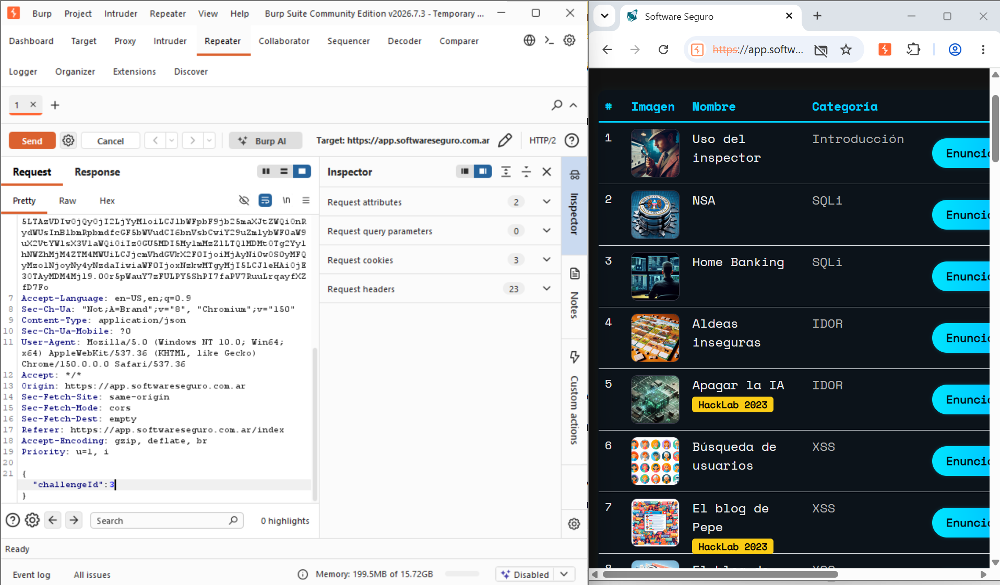
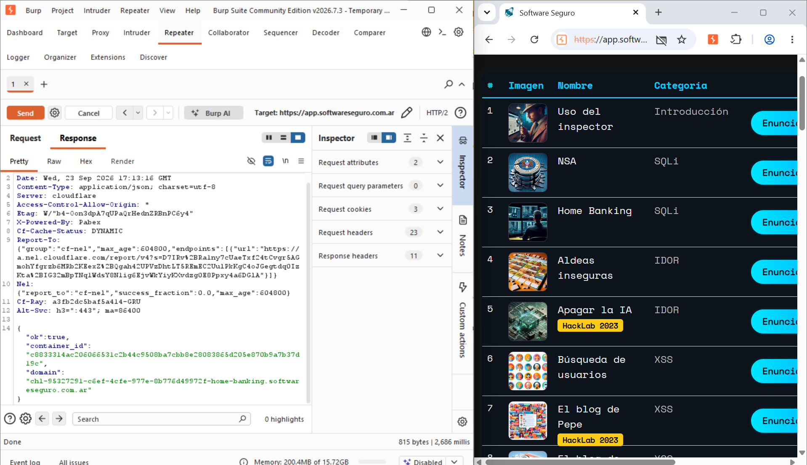
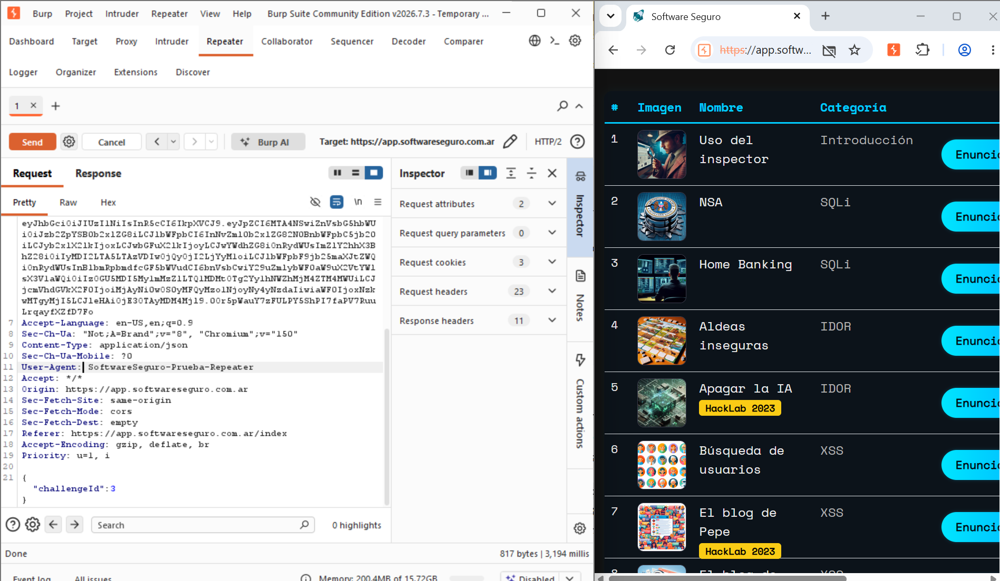
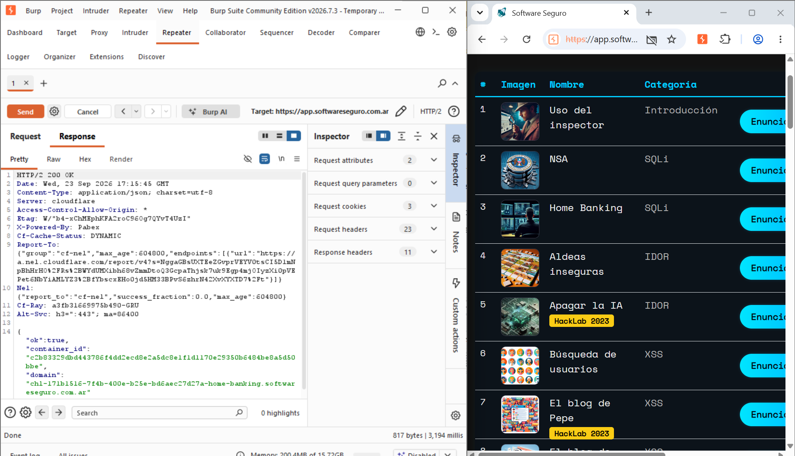

# Objetivo 2: Manipulación Manual de Peticiones (Uso del Repeater)

## Introducción

En esta actividad se utilizó el módulo **Repeater de Burp Suite
Community Edition** para reenviar y modificar manualmente una petición
HTTP capturada previamente en el laboratorio de Software Seguro.

Repeater permite tomar una petición HTTP/HTTPS, modificar sus headers,
parámetros o body y enviarla nuevamente al servidor de forma manual.
Esto resulta útil para analizar cómo responde una aplicación ante
diferentes variaciones de una misma solicitud.

La práctica se realizó exclusivamente sobre el entorno autorizado de
**Software Seguro**.

------------------------------------------------------------------------

## Petición utilizada

Se reutilizó la petición identificada durante el objetivo anterior:

``` http
POST /start-challenge
Host: app.softwareseguro.com.ar
Content-Type: application/json
```

El body de la petición contenía:

``` json
{
  "challengeId": 3
}
```

El valor `challengeId: 3` correspondía al laboratorio **Home Banking**
utilizado durante la práctica.

------------------------------------------------------------------------

## Envío de la petición al Repeater

Desde el historial HTTP de Burp Suite se seleccionó la petición
`POST /start-challenge` y se envió al módulo **Repeater**.

Una vez dentro de Repeater fue posible visualizar y editar manualmente
la solicitud antes de volver a enviarla al servidor.

### Petición original en Repeater



En esta primera prueba se mantuvieron los valores originales de la
petición.

------------------------------------------------------------------------

## Primera prueba: petición sin modificaciones

Antes de realizar cambios se presionó **Send** para establecer una
prueba de control y observar la respuesta del servidor ante la petición
original.

El servidor respondió correctamente y devolvió una respuesta con:

``` http
HTTP/2 200 OK
```

El contenido JSON observado incluía una estructura similar a:

``` json
{
  "ok": true,
  "container_id": "<identificador>",
  "domain": "<dominio-del-laboratorio>"
}
```

El valor `"ok": true` indicó que la solicitud fue procesada
correctamente y se obtuvo una instancia del laboratorio Home Banking.

### Respuesta de la petición original



------------------------------------------------------------------------

## Segunda prueba: modificación manual del User-Agent

Para demostrar la manipulación manual de una petición se modificó
únicamente el header **User-Agent**.

Originalmente, la petición utilizaba un User-Agent correspondiente al
navegador, similar a:

``` http
User-Agent: Mozilla/5.0 (Windows NT 10.0; Win64; x64) ...
```

Desde Repeater se reemplazó manualmente por:

``` http
User-Agent: SoftwareSeguro-Prueba-Repeater
```

El resto de la petición se mantuvo sin modificaciones, incluido el body:

``` json
{
  "challengeId": 3
}
```

### Request con User-Agent modificado



En la captura se puede observar que el nuevo valor fue introducido
directamente desde el módulo Repeater antes de reenviar la petición.

------------------------------------------------------------------------

## Respuesta de la petición modificada

Después de modificar el `User-Agent`, se volvió a presionar **Send**.

El servidor respondió nuevamente:

``` http
HTTP/2 200 OK
```

y el JSON de respuesta volvió a indicar:

``` json
{
  "ok": true,
  "container_id": "<identificador>",
  "domain": "<dominio-del-laboratorio>"
}
```

Esto demuestra que la petición pudo ser modificada manualmente y
reenviada desde Repeater, y que en esta prueba concreta el cambio del
header `User-Agent` no impidió que el endpoint procesara la solicitud.

### Response luego de modificar el User-Agent



------------------------------------------------------------------------

## Comparación de las pruebas

  ----------------------------------------------------------------------------------
  Prueba                  User-Agent                         Resultado
  ----------------------- ---------------------------------- -----------------------
  Petición original       `Mozilla/5.0 ...`                  `HTTP/2 200 OK` y
                                                             `"ok": true`

  Petición modificada     `SoftwareSeguro-Prueba-Repeater`   `HTTP/2 200 OK` y
                                                             `"ok": true`
  ----------------------------------------------------------------------------------

El resultado muestra que ambas solicitudes fueron procesadas
correctamente.

Esto no implica por sí mismo la existencia de una vulnerabilidad. La
prueba demuestra el funcionamiento de Repeater y que el header
`User-Agent` pudo modificarse manualmente sin impedir, en este caso, el
procesamiento de `/start-challenge`.

------------------------------------------------------------------------

## Flujo realizado

``` text
Petición interceptada
        |
        v
POST /start-challenge
        |
        v
Send to Repeater
        |
        v
Petición original
User-Agent: Mozilla/5.0...
        |
      Send
        |
        v
HTTP/2 200 OK
        |
        v
Modificar User-Agent
        |
        v
User-Agent: SoftwareSeguro-Prueba-Repeater
        |
      Send
        |
        v
HTTP/2 200 OK
```

------------------------------------------------------------------------

## ¿Qué permite hacer Repeater?

Durante esta actividad se comprobó que Repeater permite trabajar
manualmente con una solicitud sin necesidad de repetir la acción desde
la interfaz web.

Entre otras cosas, permite modificar:

-   Headers HTTP.
-   Cookies.
-   Parámetros de una URL.
-   Datos enviados en el body.
-   Valores JSON.
-   Métodos y otros elementos de una petición.

Cada modificación puede enviarse manualmente utilizando **Send**,
permitiendo comparar las respuestas obtenidas.

------------------------------------------------------------------------

## Consideraciones de seguridad

Las capturas generadas por herramientas de interceptación pueden
contener información sensible, como cookies, tokens de sesión o
identificadores internos.

Antes de publicar evidencias en un repositorio público se recomienda
ocultar cualquier valor de autenticación que no sea necesario para
demostrar la actividad.

Las pruebas de este ejercicio se realizaron únicamente sobre el
laboratorio autorizado de Software Seguro.

------------------------------------------------------------------------

## Conclusión

En esta actividad se utilizó el módulo **Repeater de Burp Suite
Community Edition** para manipular manualmente una petición HTTP.

Se tomó la solicitud:

``` http
POST /start-challenge
```

que enviaba:

``` json
{
  "challengeId": 3
}
```

Primero se ejecutó la petición sin modificaciones y se obtuvo una
respuesta `HTTP/2 200 OK` con `"ok": true`.

Luego se modificó manualmente el header:

``` http
User-Agent: SoftwareSeguro-Prueba-Repeater
```

y se volvió a enviar la solicitud.

El servidor respondió nuevamente con `HTTP/2 200 OK` y `"ok": true`.

De esta manera se comprobó de forma práctica cómo Repeater permite
modificar y reenviar solicitudes HTTP para observar el comportamiento de
una aplicación ante cambios controlados en las peticiones.
